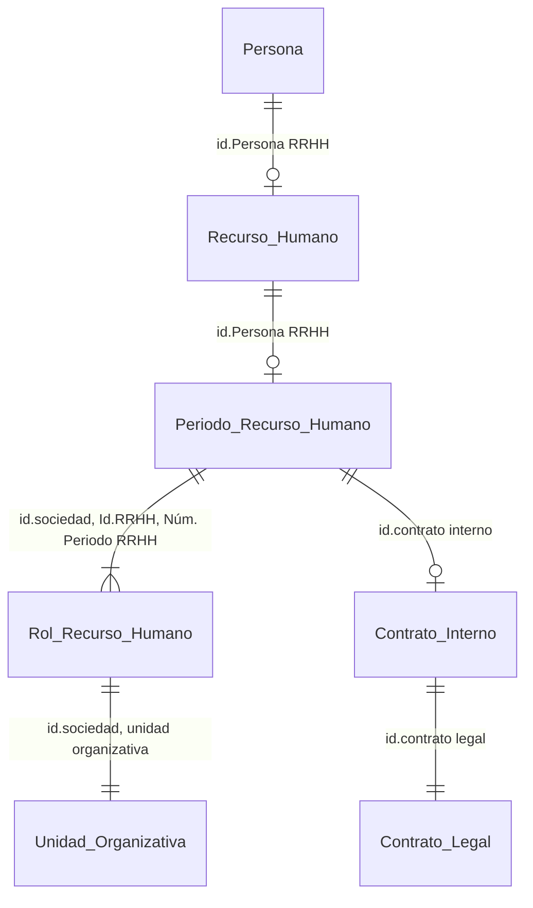

:skull_and_crossbones:

Fuentes fontawesome, no funcionan en Typora pero sí en MKdocs con pip:  :fa-coffee:   :fa-beer: :fa-cc-paypal: :fa-comments:

```
!!! todo
```

```sql
/* 
	Comentario
*/
SELECT C1,C2 
FROM TABLE1
WHERE C1='kakita'
```
```python
print('Hola mundo!!')
```

